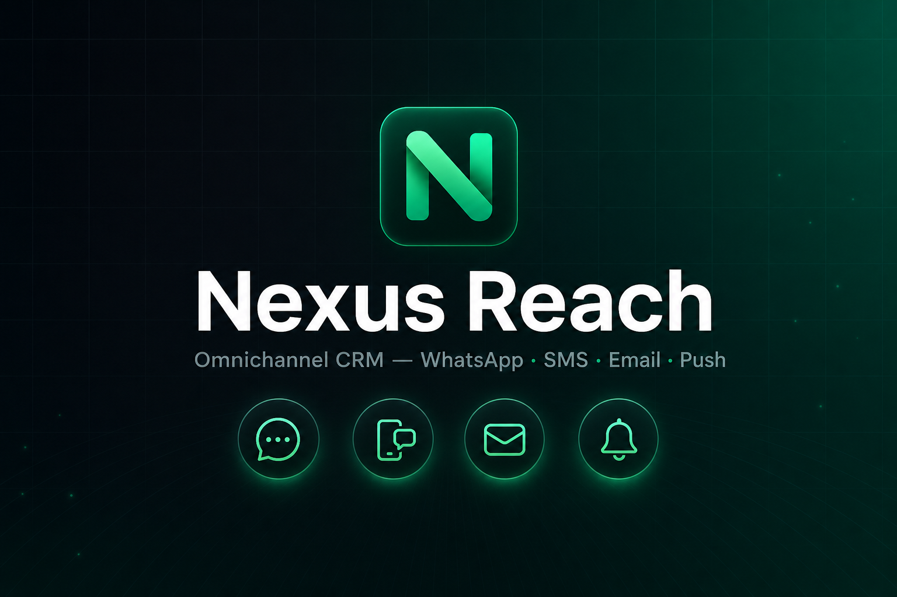
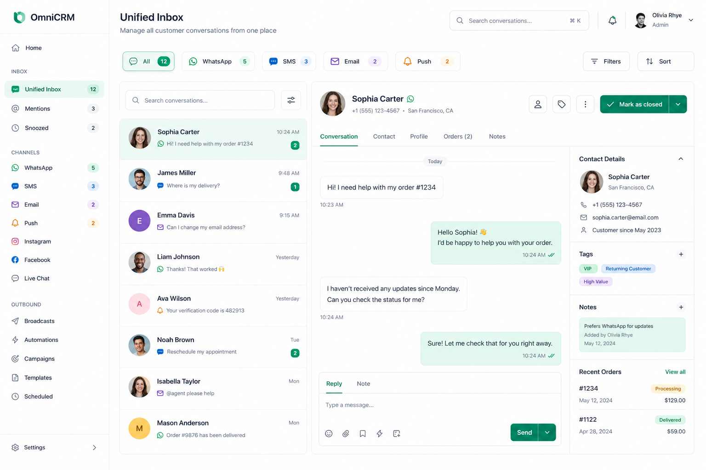
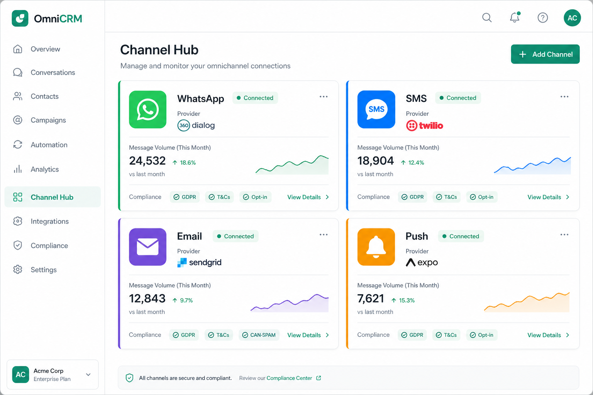
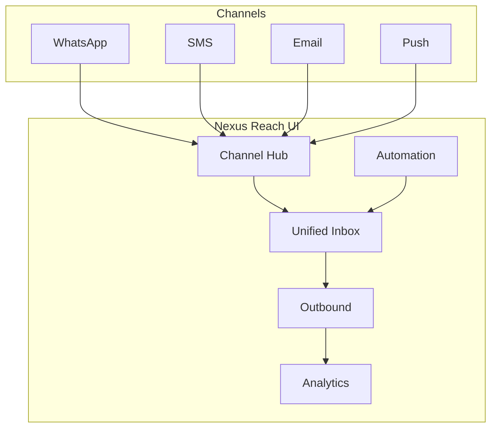

<p align="center">
  
</p>

<h1 align="center">Nexus Reach</h1>

<p align="center">
  <strong>Omnichannel CRM UI</strong> — WhatsApp, SMS, Email & Push in one control plane.<br/>
  <em>Industry-style demo for inbox, outbound campaigns, automation & analytics.</em>
</p>

<p align="center">
  <a href="https://nextjs.org"></a>
  <a href="https://react.dev"></a>
  <a href="https://www.typescriptlang.org"></a>
  <a href="https://tailwindcss.com"></a>
  
</p>

<p align="center">
  <a href="#-screenshots">Screenshots</a> •
  <a href="#-features">Features</a> •
  <a href="#-quick-start">Quick start</a> •
  <a href="#-project-structure">Structure</a> •
  <a href="#-roadmap">Roadmap</a>
</p>

---

## Overview

**Nexus Reach** is a modern **front-end demo** of an omnichannel customer engagement platform — the kind of UI you see on products like Respond.io, Wati, Braze, or Zendesk Sunshine.

| Channel | Inbox | Outbound | Analytics |
|---------|:-----:|:--------:|:---------:|
| WhatsApp | ✅ | ✅ | ✅ |
| SMS | ✅ | ✅ | ✅ |
| Email | ✅ | ✅ | ✅ |
| Push | ✅ | ✅ | ✅ |

> **Note:** This repo is a **UI prototype** with mock data. No real WhatsApp / SMS / Email / Push APIs are connected yet. Ideal for portfolios, investor demos, and SaaS MVP design references.

---

## Screenshots

### Unified inbox & dashboard

<p align="center">
  
</p>
<p align="center"><sub>Unified inbox — filter by WhatsApp, SMS, Email, or Push</sub></p>

### Channel hub

<p align="center">
  
</p>
<p align="center"><sub>Channel hub — providers, health, compliance per channel</sub></p>

---

## Features

### Omnichannel architecture

- **Unified inbox** — all conversations in one list; channel tabs for segregation  
- **Channel hub** (`/channels`) — connection status, providers, volume, compliance matrix  
- **Per-channel navigation** — sidebar links open inbox pre-filtered by channel  

### Engagement

- **Contacts** — search, tags, owners, bulk actions  
- **Outbound** — multi-channel campaigns, templates, drip sequences, funnels  
- **Automation** — trigger catalog & rule examples (demo)  
- **Pipeline** — drag-and-drop Kanban for sales stages  

### Insights & admin

- **Analytics** — charts + per-channel performance cards (Recharts)  
- **Team** — agents, roles, presence  
- **Settings** — channel integrations + workspace sections  

### UX polish

- Light / dark theme (system-aware)  
- Responsive layout (mobile drawer, inbox 3-column → stacked)  
- Page transitions, staggered cards, hover micro-interactions  
- Demo banner + **Home** onboarding map (Hindi-friendly copy in UI)  

---

## Quick start

### Prerequisites

- **Node.js** 20+  
- **npm** 10+ (or pnpm / yarn)

### Install & run

```bash
git clone https://github.com/YOUR_USERNAME/whatsapp-crm.git
cd whatsapp-crm
npm install
npm run dev
```

Open **[http://localhost:3000](http://localhost:3000)**

| URL | Description |
|-----|-------------|
| `/` | Marketing landing page |
| `/login` | Sign-in (any email/password → demo) |
| `/home` | Product map & channel volume |
| `/channels` | Channel command center |
| `/inbox` | Unified omnichannel inbox |
| `/campaigns` | Outbound campaigns |
| `/analytics` | Dashboards |

### Production build

```bash
npm run build
npm start
```

### Lint

```bash
npm run lint
```

---

## Project structure

```
whatsapp-crm/
├── docs/images/          # README screenshots & banner
├── public/
├── src/
│   ├── app/              # Next.js App Router pages
│   │   ├── (dashboard)/  # Shell: inbox, channels, campaigns, …
│   │   ├── login/
│   │   └── page.tsx      # Marketing home
│   ├── components/
│   │   ├── channels/     # ChannelBadge, ChannelTabs, ChannelsHub
│   │   ├── layout/       # Sidebar, header, shell
│   │   ├── inbox/
│   │   ├── campaigns/
│   │   └── ui/
│   ├── data/mock/        # Types + seed data
│   └── lib/
│       ├── channels.ts   # Channel metadata (WA, SMS, email, push)
│       └── stores/       # Zustand UI state
└── package.json
```

---

## Tech stack

| Layer | Choice |
|-------|--------|
| Framework | [Next.js 16](https://nextjs.org) (App Router) |
| UI | [React 19](https://react.dev) + [Tailwind CSS 4](https://tailwindcss.com) |
| Icons | [Lucide](https://lucide.dev) |
| Charts | [Recharts](https://recharts.org) |
| State | [Zustand](https://zustand.docs.pmnd.rs) (persisted theme, inbox filters) |
| Fonts | [Geist](https://vercel.com/font) |

---

## Architecture (conceptual)



---

## Configuration

| Item | Location |
|------|----------|
| Theme & inbox filters | `src/lib/stores/ui-store.ts` (localStorage key `wa-crm-ui`) |
| Channel definitions | `src/lib/channels.ts` |
| Mock data | `src/data/mock/index.ts` |
| Global styles | `src/app/globals.css` |

---

## Roadmap (toward real SaaS)

- [ ] Meta WhatsApp Cloud API + template sync  
- [ ] SMS provider (Twilio / MSG91)  
- [ ] Email (SendGrid / SES)  
- [ ] Push (FCM / APNs)  
- [ ] Auth, multi-tenant workspaces, billing  
- [ ] Real-time inbox (WebSockets)  
- [ ] Webhooks & REST API  

---

## Disclaimer

This project is a **UI demonstration**. It is not affiliated with Meta, WhatsApp, or any BSP. For production use you need official API accounts, approved templates, and compliance (opt-in, TCPA, CAN-SPAM, push consent).

---

## License

MIT — use freely for learning, portfolios, and as a starter for your own product.

---

<p align="center">
  Built with Next.js · Designed for omnichannel CRM workflows<br/>
  <sub>⭐ Star this repo if it helps your portfolio or SaaS journey</sub>
</p>
